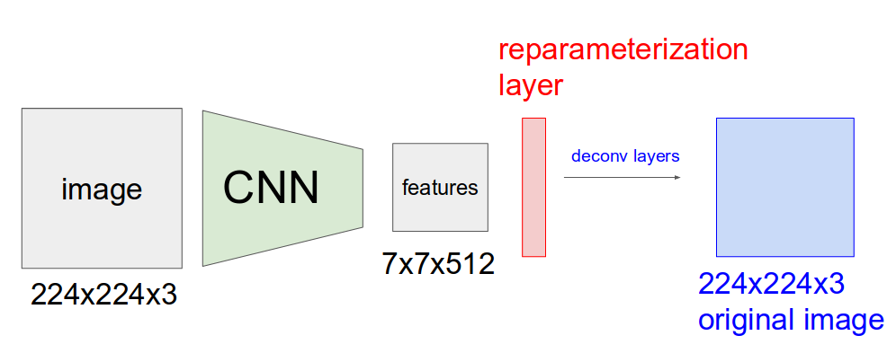

## Variational AutoEncoder in Pytorch for Generating Dogs and Cat Images
#### Network Architecture

Kaggle Dogs and Cats Dataset was used.

You can Download the Dataset [here](https://www.microsoft.com/en-us/download/details.aspx?id=54765)

Some of the Images Generated 

You may get different results based on the encoder used